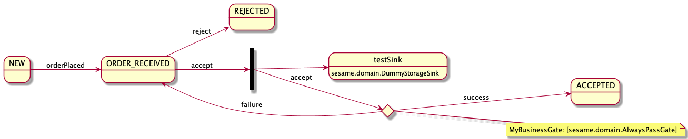

# Sesame - simple tool to process business objects through a state model

## Why did I implement it and what does it do ?
Over the years I came across multiple projects where I had to take a business object and run it through a 
basic state flow. Normally I wanted to know when things transition as well as have the ability to have some checks 
in place to prevent the transition from happening.

Whenever I had to do that I ended up looking for a framework that could help me but never really found anything fitting.
Sure there is Spring Statemachine as well as other implementations, but it never felt like a perfect fit for me.

This is why I decided to write my own little framework and publish it in case you are in a similar position.

This is in no way a perfectly designed or implemented framework. I put it together in my free time to solve a particular problem for me.
Therefore, feel free to use it but if it doesn't work for you I am sure there will be something else out there as well.

Or you could simply create a Pull Request to add the functionality you like.

## Getting Started 

### Configuration
The framework is very simple to use. You can create a sample json config for your state model and use the factory to create 
the StateMachine.

Sample config
```json
{
  "NEW": {
    "orderPlaced": {
      "nextState": "ORDER_RECEIVED"
    }
  },
  "ORDER_RECEIVED": {
    "accept": {
      "nextState": "ACCEPTED",
      "sinks": [
        {
          "class": "sesame.domain.DummyStorageSink",
          "name" : "testSink"
        }
      ],
      "gates": [{
        "class": "sesame.domain.AlwaysPassGate",
        "name": "MyBusinessGate"
      }]
    },
    "reject": {
      "nextState": "REJECTED"
    }
  },
  "ACCEPTED": {},
  "REJECTED": {}
}
```

This configuration creates the following diagram



### Creating a StateMachine
The following code will generate a StateMachine for a Business Object called ```YourBusinessObject```.
All your gates & sinks on that workflow would need to use the same Business Object to work properly. 

```kotlin
val stateConfig = object {}.javaClass.getResource("/yourConfig.json")!!.readText().trimIndent()
val stateMachine = StateMachineFactory.createStateMachine<YourBusinessObject>(sampleStateModel, name)
```


### Gates
In case you only want to transition from one state to another you can put a Gate onto that transition. You are free to put as many Gates
as you like onto one transition and your business object will only move to the resulting state if all Gates are passed successfully.

You can implement a Gate like so

```kotlin
class AlwaysBlockGate(override val name: String): Gate<Any> {
    override fun accept(event: Event, stateObject: Any): GateResponse {
        // I can put my logic here to come up with a result and then create a GateResponse with either true or false
        // Optionally you can also provide error message(s) as part of your response
        return GateResponse(false)
    }
}
```

### Sinks
Another thing that I sometimes wanted to do is do something if a transition even is triggered. This could 
be as simple as creating an audit log or just logging. For that I added Sinks. Below is a simple LoggingSink example

```kotlin
class LoggingSink(override val name: String = "LoggingSink") : Sink<MyBusinessObject> {
    override fun action(event: Event, stateObject: MyBusinessObject) {
        println("$event has just been triggered for $stateObject")
    }
}
```

### Events
Events are what you would trigger to transition from one State to another. They are very simple to implement. A very basic example can be found below

```kotlin
class TestEvent(override val name: String): Event
```

I typically have some constants / enums setup to maintain all valid events. Should an event be triggered that is not available for a particular
state you will receive an error back from the state engine


### use the State Machine
Using the State Machine is quite simple. You can just like so

```kotlin
val event = TestEvent("orderPlaced")
val myStateConfigFile = object {}.javaClass.getResource("/myStateConfigFile.json")!!.readText().trimIndent()

val stateMachine = StateMachineFactory.createStateMachine<MyBusinessObject>(sampleStateModel)
val result = stateMachine.processEvent(event, NEW.state, Any())
print(result.state // this is the state that should be set on the business object )
```


### Generate graph representation

Often it is easier to understand a complex workflow as a graph. Therefore, I added the ability to generate a graph workflow from your configuration.

#### Setup required
- Install Graphviz
- Ensure your graphviz installation is in the correct path. You can check the documentation [here](https://plantuml.com/graphviz-dot)
- If it is not installed in the expected path ( e.g. via brew on Mac ) you can set the `GRAPHVIZ_DOT` environment variable to point to the `dot` command

#### Steps to generate Graph
Below example uses a config for a business object of type <Any> but that shouldn't really matter for the graph generation.

```kotlin

        val stateModelJson = object {}.javaClass.getResource(configPath)!!.readText().trimIndent()
        val config = StateMachineConfig<Any>(stateModel)
        // this generates the graph output
        GraphGenerator<Any>().generatePngAndSaveToDisk("myOutputFileName.png", config)
        
        // or if you want the plantuml config you can also call 
        println(GraphGenerator<Any>().generatePlantumlConfigFromStateMachineConfig(config))

```


